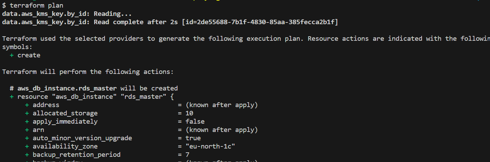
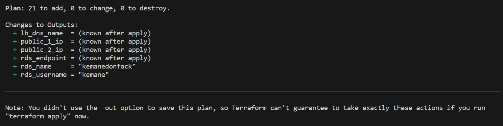
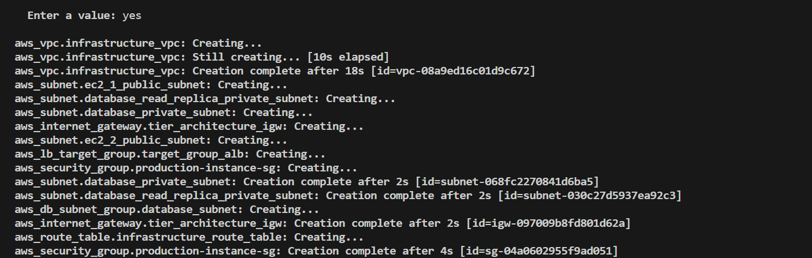
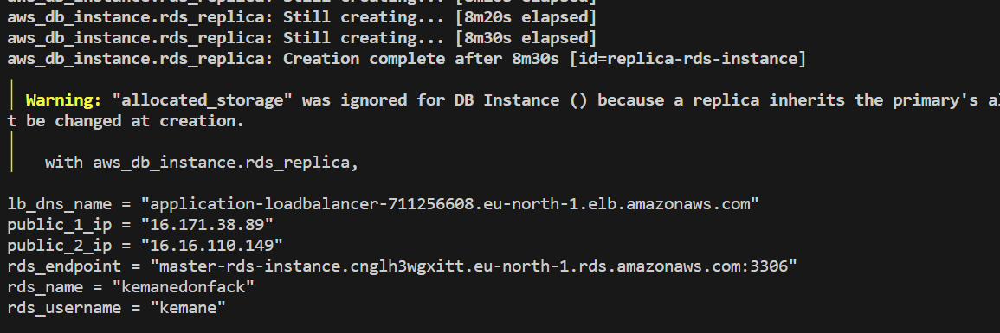
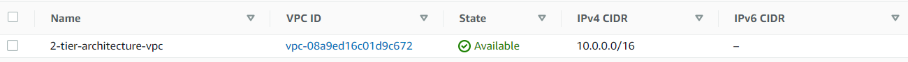
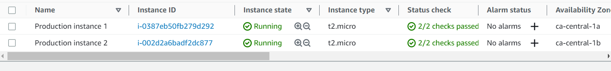
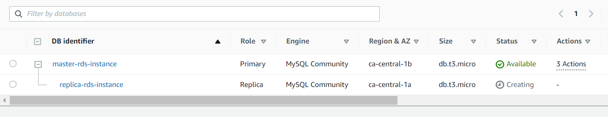
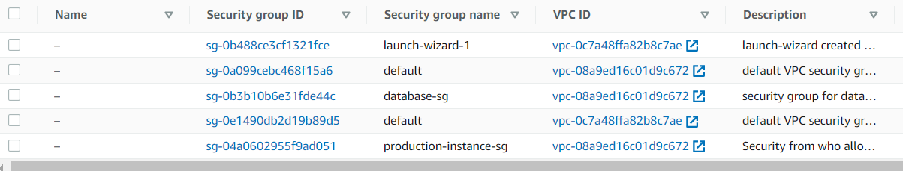
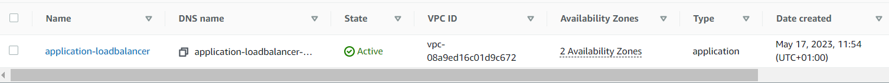
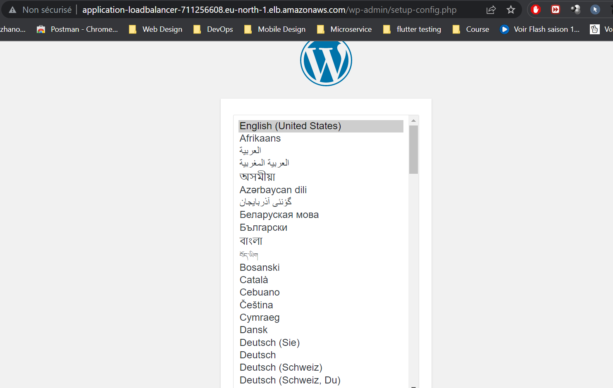

# AWS Scale WordpPress

## Introduction

In today's article, we will explore the scalability possibilities of deploying WordPress on AWS. Building upon our previous article on deploying WordPress on a 2-Tier AWS architecture with Terraform, we will focus on utilizing the Auto Scaling Group (ASG) feature, along with leveraging Amazon S3 for media storage and CloudFront for caching. These enhancements will enable us to scale our WordPress deployment effectively and handle increasing traffic demands. So let's dive in!

If you haven't read the previous article, "Deploying WordPress on a 2-Tier AWS Architecture with Terraform," we highly recommend checking it out first. It provides a comprehensive guide on setting up the initial 2-Tier architecture, which forms the foundation for this scalability enhancement.

[Link to the previous article: Deploying WordPress on a 2-Tier AWS Architecture with Terraform]


## Prerequisites

Before we proceed with scaling our WordPress deployment on AWS, make sure you have the following prerequisites in place:
- An AWS account with appropriate permissions to create resources.
- Basic knowledge of Terraform and its concepts.
- Familiarity with WordPress and its deployment on AWS, as discussed in our previous article.

## Using Auto Scaling Group for Scalability

Auto Scaling Group (ASG) is a powerful AWS feature that allows you to automatically adjust the number of instances in your application fleet based on demand. By using ASG, we can ensure our WordPress deployment can scale horizontally to handle varying loads.

In this section, we will explain the modifications made to the existing Terraform files to incorporate ASG into our WordPress deployment.

If you would like to delve deeper into the concept of Auto Scaling Group and its benefits, I have a dedicated article that covers it in detail. It provides valuable insights into how ASG works, and its configuration options.

[Link to the article: Understanding Auto Scaling Group in AWS]

### Step 1: Modifying main.tf

In the main.tf file, we need to remove our 2 aws_instance resources and add some new resources : aws_launch_template to define the configuration for our EC2 instances The template specifies the AMI, instance type, security groups, and other parameters. 

```terraform
resource "aws_launch_template" "instances_configuration" {
  name_prefix            = "asg-instance"
  image_id               = var.ami
  key_name               = aws_key_pair.aws_ec2_access_key.id
  instance_type          = var.instance_type
  vpc_security_group_ids = [aws_security_group.production-instance-sg.id]

  lifecycle {
    create_before_destroy = true
  }

  tags = {
    Name = "asg-instance"
  }
}
```

In the same main.tf file, we will create the Autoscaling Group (aws_autoscaling_group) resource. The ASG will be responsible for managing the number of instances and ensuring they match the desired capacity.

`main.tf`
```terraform
resource "aws_autoscaling_group" "asg" {
  name                      = "asg"
  min_size                  = 2
  max_size                  = 4
  desired_capacity          = 2
  health_check_grace_period = 150
  health_check_type         = "ELB"
  vpc_zone_identifier       = [aws_subnet.ec2_1_public_subnet.id, aws_subnet.ec2_2_public_subnet.id]

  launch_template {
    id      = aws_launch_template.instances_configuration.id
    version = "$Latest"
  }

  tag {
    key                 = "Name"
    value               = "production-instance"
    propagate_at_launch = true
  }

  depends_on = [
    aws_db_instance.rds_master,
  ]
}
```

Next, we'll define an Auto Scaling policy that adjusts the number of instances based on CPU utilization.

`main.tf`

```terraform
resource "aws_autoscaling_policy" "avg_cpu_policy_greater" {
  name                   = "avg-cpu-policy-greater"
  policy_type            = "TargetTrackingScaling"
  autoscaling_group_name = aws_autoscaling_group.asg.id

  target_tracking_configuration {
    predefined_metric_specification {
      predefined_metric_type = "ASGAverageCPUUtilization"
    }
    target_value = 50.0
  }
}
```

### Step 2: Modifying loadbalancer.tf

we modified the loadbalancer.tf to ensure that the ALB is properly configured to handle incoming HTTP traffic on port 80 and forward it to the instances registered with the ASG. The ALB acts as the entry point for client requests and distributes the traffic evenly across the instances in the ASG.

```terraform
resource "aws_lb" "alb" {
  name               = "asg-alb"
  internal           = false
  load_balancer_type = "application"
  security_groups    = [aws_security_group.alb_sg.id]
  subnets            = [aws_subnet.ec2_1_public_subnet.id, aws_subnet.ec2_2_public_subnet.id]
}

resource "aws_lb_listener" "alb_listener" {
  load_balancer_arn = aws_lb.alb.arn
  port              = "80"
  protocol          = "HTTP"

  default_action {
    type             = "forward"
    target_group_arn = aws_lb_target_group.alb_target_group.arn
  }
}

resource "aws_lb_target_group" "alb_target_group" {
  name     = "asg-target-group"
  port     = 80
  protocol = "HTTP"
  vpc_id   = aws_vpc.infrastructure_vpc.id
}
```

`security_group.tf`

we have also created a security group for the ALB

```terraform
resource "aws_security_group" "alb_sg" {
  name = "asg-alb-sg"
  ingress {
    from_port   = 80
    to_port     = 80
    protocol    = "tcp"
    cidr_blocks = ["0.0.0.0/0"]
  }

  egress {
    from_port   = 0
    to_port     = 0
    protocol    = "-1"
    cidr_blocks = ["0.0.0.0/0"]
  }

  vpc_id = aws_vpc.infrastructure_vpc.id
}
```

### Step 3: Modifying efs.tf

In this step, we make several modifications to the efs.tf file to ensure compatibility with the latest version of WordPress and integrate it with the Auto Scaling Group (ASG) setup.

Firstly, we update the installation script to use the latest version of WordPress. This update is necessary because the WP Offload S3 Lite plugin, which we will be using, requires the latest version of WordPress. Here is the modified installation script:

```terraform
resource "null_resource" "install_script" {
  count = 2

  depends_on = [
    aws_db_instance.rds_master,
    local_file.private_key,
    aws_efs_mount_target.efs_mount_target_1,
    aws_efs_mount_target.efs_mount_target_2,
    aws_autoscaling_group.asg
  ]

  connection {
    type        = "ssh"
    host        = data.aws_instances.production_instances.public_ips[count.index]
    user        = "ec2-user"
    private_key = file(var.private_key_location)
  }

  provisioner "remote-exec" {
    inline = [
      "sudo yum update -y",
      "sudo yum install docker -y",
      "wget https://github.com/docker/compose/releases/latest/download/docker-compose-$(uname -s)-$(uname -m)",
      "sudo mv docker-compose-$(uname -s)-$(uname -m) /usr/local/bin/docker-compose",
      "sudo chmod -v +x /usr/local/bin/docker-compose",
      "sudo systemctl enable docker.service",
      "sudo systemctl start docker.service",
      "sudo yum -y install amazon-efs-utils",
      "sudo mkdir -p ${var.mount_directory}",
      "sudo mount -t efs -o tls ${aws_efs_file_system.efs_volume.id}:/ ${var.mount_directory}",
      "sudo docker run --restart=always --name wordpress-docker -e WORDPRESS_DB_USER=${aws_db_instance.rds_master.username} -e WORDPRESS_DB_HOST=${aws_db_instance.rds_master.endpoint} -e WORDPRESS_DB_PASSWORD=${aws_db_instance.rds_master.password} -e WORDPRESS_DB_NAME=${aws_db_instance.rds_master.db_name} -v ${var.mount_directory}:${var.mount_directory} -p 80:80 -d wordpress",
    ]
  }
}

```

Additionally, we replace the reference to the previous EC2 instances with the Auto Scaling Group in the following data block:

```terraform
data "aws_instances" "production_instances" {
  instance_tags = {
    "Name" = "production-instance"
  }
  depends_on = [
    aws_autoscaling_group.asg
  ]
}
```

## Creating S3 Bucket and CloudFront distribution

In this section, we will create an S3 bucket to store the media files of the WordPress application and set up a CloudFront distribution to cache and serve these assets globally, providing improved performance and reduced latency for users.

Before starting add these two variables in your `variables.tf` file

```terraform
variable "bucket_name" {
  type    = string
  default = "my-s3-wordpress-bucket"
}

variable "s3_origin_id" {
  type    = string
  default = "my-s3-wordpress-origin"
}
```

### Step 1: Creating the S3 Bucket

First, we define an S3 bucket resource using Terraform to store the media files of the WordPress application:

```terraform
resource "aws_s3_bucket" "wordpress_files_bucket" {
  bucket = var.bucket_name
  tags   = {
    name = "wordpress-bucket"
  }
}
```

In this resource, we specify the desired bucket name as the value of the variable `var.bucket_name`. We also add a tag to the bucket for better identification.

### Step 2: Configuring CloudFront Origin Access Control

Next, we configure the CloudFront Origin Access Control (OAC) to manage access to the S3 bucket:

```terraform
locals {
  s3_origin_id = var.s3_origin_id
}

resource "aws_cloudfront_origin_access_control" "my_origin" {
  name                              = local.s3_origin_id
  description                       = "Origin access control"
  origin_access_control_origin_type = "s3"
  signing_behavior                  = "always"
  signing_protocol                  = "sigv4"
}
```

The `aws_cloudfront_origin_access_control` resource defines access control settings for the S3 bucket as an origin. We set the `signing_behavior` and `signing_protocol` to "always" and "sigv4," respectively, to enforce the use of AWS Signature Version 4 for all requests made to the CloudFront distribution.

### Step 3: Creating CloudFront Distribution

Now, we create the CloudFront distribution that will cache and serve the media files stored in the S3 bucket:

```terraform
data "aws_cloudfront_cache_policy" "cache-optimized" {
  name = "Managed-CachingOptimized"
}

resource "aws_cloudfront_distribution" "s3_distribution" {
  origin {
    domain_name              = aws_s3_bucket.wordpress_files_bucket.bucket_regional_domain_name
    origin_access_control_id = aws_cloudfront_origin_access_control.my_origin.id
    origin_id                = local.s3_origin_id
  }

  enabled         = true
  is_ipv6_enabled = true
  comment         = "my-cloudfront"

  default_cache_behavior {
    cache_policy_id        = data.aws_cloudfront_cache_policy.cache-optimized.id
    allowed_methods        = ["DELETE", "GET", "HEAD", "OPTIONS", "PATCH", "POST", "PUT"]
    cached_methods         = ["GET", "HEAD"]
    target_origin_id       = local.s3_origin_id
    viewer_protocol_policy = "allow-all"
    min_ttl                = 0
    default_ttl            = 3600
    max_ttl                = 86400
  }

  price_class = "PriceClass_All"

  restrictions {
    geo_restriction {
      restriction_type = "none"
      locations        = []
    }
  }

  viewer_certificate {
    cloudfront_default_certificate = true
  }
}
```

In this resource, we define the CloudFront distribution and specify the S3 bucket as the origin to be associated with the distribution. The `cache_policy_id` refers to the managed caching policy named "Managed-CachingOptimized," which optimizes cache behavior for better performance.

We also set the `default_cache_behavior` to cache the allowed HTTP methods and define caching TTLs (time-to-live) for the assets. The `viewer_protocol_policy` is set to "allow-all" to allow both HTTP and HTTPS access.

Additionally, we specify the CloudFront distribution to use the default SSL/TLS certificate provided by AWS (`cloudfront_default_certificate = true`) for secure connections.

#### Step 4: Configuring S3 Bucket Policy for CloudFront Access

Finally, we create an S3 bucket policy to allow CloudFront access to the bucket:

```terraform
data "aws_iam_policy_document" "s3_policy" {
  statement {
    sid       = "AllowCloudFrontServicePrincipal"
    actions   = ["s3:GetObject"]
    resources = ["${aws_s3_bucket.wordpress_files_bucket.arn}/*"]
    condition {
      test     = "StringEquals"
      variable = "AWS:SourceArn"
      values   = ["${aws_cloudfront_distribution.s3_distribution.arn}"]
    }
    principals {
      type        = "Service"
      identifiers = ["cloudfront.amazonaws.com"]
    }
  }
}

resource "aws_s3_bucket_policy" "mybucket" {
  bucket = aws_s3_bucket.wordpress_files_bucket.id
  policy = data.aws_iam_policy_document.s3_policy.json
}
```

In this step, we define an IAM policy document that allows CloudFront service principal (`cloudfront.amazonaws.com`) to access the S3 bucket's objects. The policy uses the `aws_s3_bucket.wordpress_files_bucket.arn` and the `aws_cloudfront_distribution.s3_distribution.arn` as resources to specify the S3 bucket and CloudFront distribution as the allowed sources.

Finally, we apply the defined S3 bucket policy using the `aws_s3_bucket_policy` resource.

With these configurations, the S3 bucket is ready to store WordPress media files, and the CloudFront distribution is set up to cache and serve these assets, providing faster and more reliable content delivery globally.


## Step 7: Deployment

To start the deployment process, we need to initialize Terraform in our project directory. This step ensures that Terraform downloads the necessary providers and sets up the backend configuration. Run the following command in your terminal:

```
terraform init
```


After initializing Terraform, we can generate an execution plan to preview the changes that will be made to our AWS infrastructure. The plan provides a detailed overview of the resources that will be created, modified, or destroyed.

To generate the plan, execute the following command:
```
terraform plan
```





Once we are satisfied with the execution plan, we can proceed with deploying our infrastructure on AWS. Terraform will provide the necessary resources and configure them according to our specifications.

To deploy the infrastructure, run the following command:

```
terraform apply
```

Terraform will prompt for confirmation before proceeding with the deployment. Type `yes` and press Enter to continue.


The deployment process will take some time. Terraform will display the progress and status of each resource being created.



Once the deployment is complete, Terraform will output the information about the provisioned resources, such as the IP addresses, DNS names, RDS endpoint, user and database name.



Finally, let's check our infrastructure from the AWS Console:











The **WordPress** installation is available via the generated Load Balancer domain:



**Important**: Let's note that we can link it to a custom domain along with an HTTP certificate by using AWS ACM service.

**Congratulations! You have successfully deployed your WordPress application on a 2-tier AWS architecture using Terraform**. You can now access your WordPress website and start customizing it to suit your needs.

The complete source code of the project is available on [GitHub]().

## Conclusion

To conclude, deploying WordPress on a 2-Tier AWS architecture with Terraform offers a reliable and scalable solution for hosting your website. This approach allows any team, regardless of their level of Cloud experience, to successfully set up and manage their WordPress application. By leveraging Terraform's infrastructure-as-code capabilities, the deployment process becomes streamlined and repeatable.

However, it is important to emphasize the significance of conducting thorough research and due diligence when selecting the appropriate AWS services and configurations for your specific requirements. Ensuring high availability, fault tolerance, and security should be prioritized during the deployment process.
